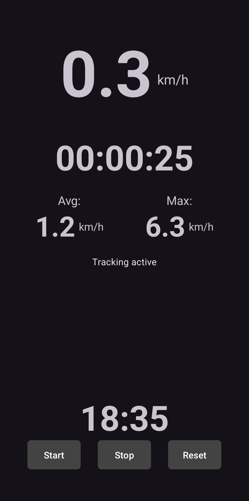

# BikeTrack

Prosta aplikacja Android do śledzenia jazdy na rowerze.

## Co to jest

Aplikacja pokazuje:

- aktualną prędkość,
- średnią prędkość,
- maksymalną prędkość,
- czas trwania przejazdu,
- aktualną godzinę.

Działa na podstawie lokalizacji urządzenia.

## Jak uruchomić

1. Otwórz projekt w Android Studio.
2. Poczekaj aż Gradle pobierze zależności i zsynchronizuje projekt.
3. Uruchom aplikację na emulatorze albo na telefonie z Androidem.
4. Przy pierwszym uruchomieniu przyznaj dostęp do lokalizacji.
5. Naciśnij `Start`, aby rozpocząć pomiar.

Wymagania:

- Android Studio,
- `minSdk 30`,
- włączona lokalizacja w urządzeniu.

## Screen

